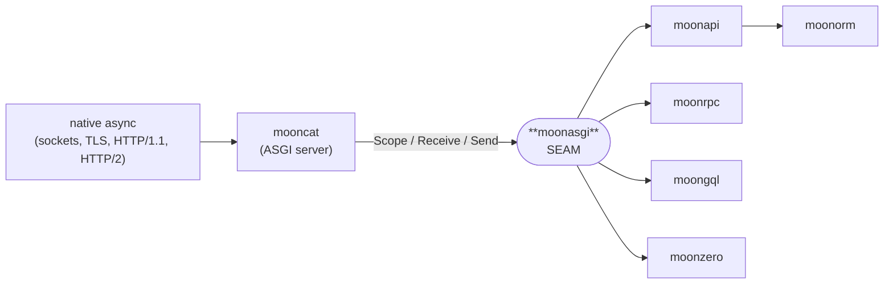

<div align="center">

# moonasgi

**MoonBit-dialect [ASGI 3.0](https://asgi.readthedocs.io/) — the load-bearing server↔app SEAM.**

[](https://github.com/moonbitstack/moonasgi/actions/workflows/ci.yml)
[](./LICENSE)
[](https://mooncakes.io/docs/Lfan-ke/moonasgi)

</div>

`moonasgi` is the backend-agnostic protocol seam every server and framework in the **moon\*** full-stack suite is built around. One typed contract — `Scope` / `Receive` / `Send` — isolates async-transport churn in a single server adapter, so the framework repos (`moonapi`, `moonorm`, `moonrpc`, `moongql`, `moonzero`) never depend on `moonbitlang/async` directly.



## The contract

```moonbit
pub enum Scope {
  Http(HttpScope)
  WebSocket(WebSocketScope)
  Lifespan(LifespanScope)
}

pub type Receive = async () -> Event          // pull the next inbound event
pub type Send    = async (Event) -> Unit      // push an outbound event
pub type AsgiApp = async (Scope, Receive, Send) -> Unit
```

Applications are usually written against the ergonomic sugar, which the server lifts onto `AsgiApp`:

```moonbit
pub type Handler    = (Request) -> Response
pub type Middleware = (Handler) -> Handler
```

`Event` is a typed sum over the full http / websocket / lifespan message sets in both directions — including the standard extension messages — replacing ASGI's stringly-typed message dicts.

## TestClient

Drive any application in-process, with no socket, on every backend. The `TestClient` is built on the synchronous `run_http_app` core: it fabricates a scope, feeds the request body in, runs the app, and reassembles the outbound event stream into a captured response.

```moonbit
let client = TestClient::new(handler)          // or ::from_stream / ::from_app
let r = client.post("/echo", body=b"payload")
assert_eq(r.status, 200)
assert_eq(r.text(), "payload")
```

It reassembles a streamed multi-chunk body, captures response trailers, server-push promises, early hints, and the path-send target, and can stream a chunked request body in via `request(..., chunks=[...])`.

## WebSocket

WebSocket app logic is testable in-process too, through the synchronous core `ws_run` — the WebSocket analog of `run_http`. A `WebSocketHandler` is written in the connect / receive / disconnect shape; the `TestClient` drives a whole connection and captures the result as a `WsTestSession`.

```moonbit
let client = TestClient::new(handler)
let session = client.websocket(
  path="/chat",
  handler=WebSocketHandler::echo(subprotocol=Some("chat")),
  send=[Text("hello"), Binary(b"\x01\x02")],
)
assert_eq(session.accepted, true)
assert_eq(session.subprotocol, Some("chat"))
assert_eq(session.texts(), ["hello"])
```

A handler can `Accept` (negotiating a subprotocol and response headers), `Reject` with a bare close code, or `DenyHttp` with a full HTTP response (the `websocket.http.response` extension). `ws_run_app` is the escape hatch for apps whose control flow is not the connect/receive/disconnect fold — it hands the whole inbound stream and full scope to the app.

## Lifespan

The lifespan protocol has the same shape as the http and WebSocket cores. A `LifespanHandler` is written as a startup and a shutdown hook; `run_lifespan` drives it over the inbound `LifespanStartup` / `LifespanShutdown` events and returns the replies a server sends. Startup seeds `scope.state` in place — the map a server then copies onto every request scope, which is how a DB pool or loaded config reaches each request. A failed startup short-circuits: the server never proceeds to shutdown, exactly as ASGI pins.

```moonbit
let app = LifespanHandler::new(
  on_startup=fn(scope) {
    scope.state["db_pool"] = Json::string("pool://greet")   // seeded in place
    Complete
  },
)
let out = run_lifespan(app, Lifespan(scope), [LifespanStartup])
assert_eq(out == [LifespanStartupComplete], true)
```

## Scope-aware core

The ergonomic `Handler` sees a `Request` — method, path, query, headers, body. A framework needs more: `root_path` for mounted sub-apps, `extensions` to gate a feature on what the server advertises, `client` for security, and `state` seeded by lifespan. `run_http_scoped` hands the app the full `HttpScope` alongside the drained body, and `run_http_app` is the `Request`-level wrapper over it.

```moonbit
run_http_scoped(fn(scope, body) {
  let prefix = scope.state.get("greeting_prefix")  // lifespan-seeded
  [HttpResponseStart(status=200, headers=[], trailers=false),
   HttpResponseBody(body, more_body=false)]
}, Http(scope), inbound)
```

## HTTP/2 and HTTP/3

`http_version` on the scope is `"1.0"`, `"1.1"`, `"2"`, or `"3"` — the SEAM is transport-agnostic, so an app runs unchanged whichever version served the request. The one place the version leaks into wiring is the request line: an HTTP/2 (RFC 7540 §8.1.2.3) or HTTP/3 request carries it as pseudo-headers (`:method`, `:scheme`, `:authority`, `:path`) interleaved with the ordinary fields, and ASGI has no slot for them in `scope["headers"]`. `HttpScope::from_h2_headers` owns that lowering so every h2/h2c/h3 transport in the suite (mooncat) produces the same scope from the same HEADERS block — pseudo-headers consumed into the typed fields, `host` synthesised from `:authority`, and no `:`-prefixed header ever reaching the app.

```moonbit
let scope = HttpScope::from_h2_headers([
  (":method", "POST"), (":scheme", "https"),
  (":authority", "example.test"), (":path", "/items?page=2"),
  ("content-type", "application/json"),
])
// -> Ok: http_method="POST", scheme="https", path="/items",
//        query_string=b"page=2", headers=[("host","example.test"), ...]
```

A malformed pseudo-header set — a missing required one, a duplicate, an unknown `:foo`, or a pseudo-header after an ordinary field — returns `Err(Http2HeaderError)` naming the first violation, so the transport can answer `RST_STREAM(PROTOCOL_ERROR)` instead of forwarding a bad scope.

## Conformance

`run_conformance()` is a table-driven harness. Every `Event` variant is checked for round-trip fidelity and for being distinct from every other one; the http, websocket and lifespan scopes and their ordering rules are driven through `run_http` / `ws_run` / `TestClient`. The out-of-band extension messages — push, pathsend, zero-copy send, debug, disconnect — are covered by the ordering tables rather than by a driver, since no driver emits them. It returns a `ConformanceReport` naming any failing check, so a downstream server can self-verify the seam wiring:

```moonbit
let report = run_conformance()
assert_eq(report.ok(), true)
```

The harness also runs a **negative table**: ASGI pins the order an app may emit messages in, and `validate_events(scope, events)` walks an outbound stream and names the first violation — a body before the response starts, a second `http.response.start`, a websocket frame before the handshake is accepted, a lifespan shutdown reply before startup, and the rest. A server can run it over its own emissions to reject a buggy app early.

```moonbit
let bad = [HttpResponseBody(body=b"x", more_body=false)]  // no start
assert_eq(validate_events(scope, bad) == Some(BodyBeforeStart), true)
```

## Extensions & streaming

The standard ASGI extensions are modelled as typed events and scope fields, not stringly-typed dicts:

- **`http.response.trailers`** — `StreamingResponse.trailers`; lowered to `HttpResponseStart{trailers: true}` + a terminating `HttpResponseTrailers`.
- **`http.response.push`** — `HttpResponsePush{path, headers}`.
- **`http.response.pathsend`** — `HttpResponsePathSend{path}`.
- **`http.response.zerocopysend`** — `HttpResponseZeroCopySend{fd, offset, count, more_body}`; captured by the `TestClient` as `TestResponse.zerocopysend`.
- **`http.response.early_hint`** — `HttpResponseEarlyHint{links}`; `StreamingResponse.early_hints`, lowered to `103 Early Hints` messages ahead of the response.
- **`http.response.debug`** — `HttpResponseDebug{info}`; an out-of-band info payload with no protocol meaning, valid anywhere in the response.
- **`websocket.http.response`** — `WebSocketHttpResponseStart` / `WebSocketHttpResponseBody`, to deny a handshake with a full HTTP response.
- **`tls`** — `TlsExtension` carried on the scope's `extensions`.

A server advertises what it honours via the typed `Extensions` capability flags; response streaming (multiple `HttpResponseBody` with `more_body: true`) is modelled by `StreamingResponse` and driven by `run_http_stream`. `spec_version` is negotiated numerically with `AsgiVersion::at_least`, and each sub-protocol carries its own default — `AsgiVersion::http()` / `websocket()` (`2.5`, the 2024-06-05 revision) and `lifespan()` (`2.0`). The `2.5` websocket revision adds `reason` to `WebSocketDisconnect`, threaded to a handler's `on_disconnect(code, reason)`.

## Compliance matrix

Every ASGI 3.0 spec feature, and the test that exercises it. `conformance` is `run_conformance()`'s in-suite battery; `test` names are the whitebox tests.

| Spec feature | Modelled as | Covered by |
|---|---|---|
| `http` scope (all fields incl. `state`, `raw_path`, `root_path`) | `HttpScope` | `conformance` scope/http-fields |
| `websocket` scope (incl. `subprotocols`, `state`) | `WebSocketScope` | `conformance` scope/ws-fields |
| `lifespan` scope (incl. `state`) | `LifespanScope` | `conformance` scope/lifespan-fields |
| `asgi` version / `spec_version` (2.5 http+ws, 2.0 lifespan) | `AsgiVersion` | `conformance` spec_version/*; test "per-subprotocol asgi spec_version defaults" |
| `spec_version` numeric negotiation | `AsgiVersion::at_least` | test "AsgiVersion negotiates spec_version numerically" |
| Every http/ws/lifespan message, both directions | `Event` (25 variants) | `conformance` event/*; test "SEAM scope and event variants construct" |
| Full scope reaches a framework (`state`, `root_path`, `extensions`) | `run_http_scoped` | `conformance` scoped/*; test "greet: moonapi http routing round-trips…" |
| `lifespan.startup` / `.shutdown` (complete / failed, in-place `state`) | `LifespanHandler` / `run_lifespan` | `conformance` lifespan/*; test "greet: lifespan startup seeds state…" |
| `http.request` drain (streamed `more_body`) | `run_http` / `TestClient` | test "TestClient streams a chunked request body into the handler" |
| `http.disconnect` | `HttpDisconnect` | `conformance` event/* |
| `http.response.start` + `.body` round-trip | `Response` / `run_http` | `conformance` http/roundtrip; test "run_http drains a chunked body…" |
| Response streaming (`more_body: true` chunks) | `StreamingResponse` / `run_http_stream` | test "TestClient reassembles a streaming multi-chunk response body" |
| `websocket.connect` / `.accept` / `.receive` / `.send` / `.close` | `WebSocketHandler` / `ws_run` | test "ws_run echoes text and binary frames…" |
| `websocket.disconnect` (2.5 `reason`) | `WebSocketDisconnect` | test "on_disconnect receives the 2.5 close code and reason" |
| Handshake reject (bare close) | `WsAccept::Reject` | test "ws handler can reject the handshake with a close code" |
| **ext** `http.response.trailers` | `StreamingResponse.trailers` | test "TestClient captures response trailers" |
| **ext** `http.response.push` | `HttpResponsePush` | test "TestClient captures server push and pathsend" |
| **ext** `http.response.pathsend` | `HttpResponsePathSend` | test "TestClient captures server push and pathsend" |
| **ext** `http.response.zerocopysend` | `HttpResponseZeroCopySend` | test "zerocopysend and debug extensions round-trip…" |
| **ext** `http.response.early_hint` | `HttpResponseEarlyHint` | test "early-hint extension round-trips through the TestClient" |
| **ext** `http.response.debug` | `HttpResponseDebug` | test "zerocopysend and debug extensions round-trip…" |
| **ext** `websocket.http.response` (denial) | `WsAccept::DenyHttp` | test "ws handler can deny the handshake with a full HTTP response" |
| **ext** `tls` | `TlsExtension` | test "Extensions builder advertises capabilities and TLS data" |
| Message-ordering rules (all message sets) | `validate_events` | `conformance` order/*; test "validator names the violation…" |
| HTTP/2·3 pseudo-header → scope lowering (`:method`/`:scheme`/`:authority`/`:path`, host synthesis, malformed rejection) | `HttpScope::from_h2_headers` / `Http2HeaderError` | `conformance` h2/* |
| `http_version` transport-agnostic seam (`"1.1"` / `"2"` / `"3"`) | `HttpScope.http_version` | `conformance` h2/seam-agnostic |

Two spec features have no direct model here. The C-level file object in `http.response.zerocopysend` is carried as an `Int` fd, because this seam is socket-free by design and the actual `sendfile` is the server adapter's (`mooncat`) job. And `send()` cannot raise on a closed connection, which the www sub-spec has required since version 2.4: `Send` is declared `async (Event) -> Unit`, so a server has no in-band way to tell an application the client went away mid-response. A body drain reports it — `run_http_scoped_drain` hands the app a `Drain` saying whether the client disconnected — but the send path does not.

## Consumed by

The seam is the only thing the server and the frameworks share. Each binds to a specific slice of it.

**[mooncat](https://github.com/moonbitstack/mooncat)** — the ASGI server. Owns the async `Receive` / `Send` and the native transport, binds `AsgiApp`, and drives every core: it drains the http request body, runs `run_lifespan` at boot and teardown, and drives WebSocket connections. It copies `LifespanScope.state` onto each `HttpScope.state`, serialises the outbound `Event` stream (`HttpResponseStart` / `HttpResponseBody` / `HttpResponseTrailers` / the extension messages) to the socket, and can run `validate_events` over an app's emissions to reject a buggy app before writing.

**[moonapi](https://github.com/moonbitstack/moonapi)** — the web framework. Binds at the scope level through `run_http_scoped`, because it reads what the ergonomic `Request` drops: `HttpScope.root_path` (mounted sub-apps), `extensions` (gate a response push or path-send on what the server advertises), `client` (security), and `state` (the lifespan-seeded pool / config). It returns `Response` and `StreamingResponse`, serves its OpenAPI document as an ordinary response, and registers `LifespanHandler` startup / shutdown hooks that mooncat runs.

**[moonzero](https://github.com/moonbitstack/moonzero)** — the service assembler. Stacks its middleware (request-id, CORS, logging, recovery) as `Middleware` values and folds them over a `Handler` with `compose`, outermost-first.

The `greet: *` whitebox tests assemble a representative app across all three shapes and drive it through these exact seam points, so the seam is proven greet-ready before any consuming repo is wired up.

## Design

- **Zero dependencies.** The seam is pure types plus a small sugar layer; the concrete `moonbitlang/async` transport types live only in the `mooncat` adapter. Async or backend churn stops at the seam (see the isolation contract).
- **Faithful, not approximate.** This is a complete transliteration of ASGI 3.0 into MoonBit idiom — the typed `Scope`/`Event` shape is the dialect, not a subset.

## Status

`v0` — the SEAM (`Scope`, `Event`, `Receive`/`Send`/`AsgiApp`, `Request`/`Response`, `Handler`/`Middleware`) plus the full ASGI-extension event set (push, pathsend, zero-copy send, trailers, early hints, debug, WebSocket denial, TLS), `StreamingResponse` response streaming, the synchronous `run_http`, `run_http_scoped`, `run_lifespan`, and `ws_run` cores, the `TestClient` in-process driver for both HTTP and WebSocket, the `run_conformance` round-trip harness (436 checks) with its `validate_events` ordering table, `HttpScope::from_h2_headers` HTTP/2·3 pseudo-header lowering, and typed `Extensions`/`tls`/`spec_version` (2.5) scope metadata — 51 tests, warning-clean across every backend. The async `Handler → AsgiApp` runtime adapter lands with `mooncat`, which owns the native async transport.

## License

Apache-2.0.
